# Audit visuel et parcours utilisateur — modules tabac

**Date :** 28 juin 2026  
**Périmètre :** premier jet accessible sur `http://localhost:5173/`  
**Méthode :** parcours Playwright sous Chromium, en 1440 × 1000 et 390 × 844, avec vérification des interactions, de la console, des débordements et des tailles de cibles.  
**Limite :** cet audit porte sur l’UX et la représentation pédagogique. Il ne constitue pas une validation médicale du contenu, des seuils ou des formulations.

## Synthèse

Le socle est fonctionnel : les six modules s’ouvrent, les principaux contrôles changent bien l’état de l’interface, aucun overlay d’erreur ni message console n’a été relevé, et les deux formats testés ne présentent pas de débordement horizontal.

En revanche, l’outil ressemble encore à un prototype fonctionnel plutôt qu’à un support visuel d’ETP. L’essentiel du sens repose sur des boutons, des listes et du texte. La palette presque monochrome, les grandes zones blanches et l’absence d’illustrations limitent l’impact à distance et la capacité du patient à comprendre « d’un coup d’œil ». Les demandes formulées nécessitent surtout de revoir les modèles d’interaction de quatre modules, pas seulement leur CSS.

### Priorités

| Priorité | Constat | Effet actuel | Recommandation |
|---|---|---|---|
| P0 | La titration débute à `1/4` et s’arrête à `4/4` | Impossible de représenter 2, 3 ou 4 patchs | Démarrer à 1 patch complet et rendre l’ajout de quarts non plafonné |
| P0 | « Le piège du soulagement » ne représente que la nicotinémie | La comparaison demandée entre stress basal et stress lié au manque est absente | Construire un graphe à deux grandeurs : stress, et nicotine seulement pour le fumeur |
| P0 | « La nicotine n’est pas le toxique » ne contient aucune image | La vue est un comparatif textuel, éloigné de l’affiche de référence | Recomposer l’affiche en scène interactive avec hotspots et bulles |
| P0 | La vue nicotine change instantanément une courbe bleue statique | Elle ne montre pas la montée et la descente « dans le temps » et ne code pas l’état en vert/rouge | Ajouter une lecture temporelle animée et colorer l’état selon les zones |
| P1 | Les composantes de l’addiction sont trois boutons indépendants | L’imbrication des dimensions n’est pas perceptible | Utiliser trois cercles qui se chevauchent, sans hiérarchie implicite |
| P1 | Les outils 4D ouvrent du texte sous la vague | Ils ne masquent pas le pic ni ne matérialisent le détournement d’attention | Faire agir chaque outil directement sur la visualisation du pic |
| P1 | Typographie et cibles parfois trop petites | Lecture à 1 m et manipulation tablette moins confortables | Passer le texte utile à 18–20 px et toutes les cibles à 44 px minimum |
| P1 | Les sources affichent un état « à compléter » | Fragilise la confiance dans un contexte de soin | Renseigner des sources propres à chaque module avant diffusion |

## 1. Direction visuelle globale

### Constat

- L’accueil est propre et cohérent, mais les cartes blanches, les icônes bleues et les résumés de petite taille donnent une apparence générique.
- À 1440 px, les six cartes occupent moins de la moitié de la hauteur disponible ; le bas de l’écran est vide.
- Le bleu sert aux actions, aux courbes, aux états actifs et aux zones explicatives. Il ne crée pas de hiérarchie sémantique.
- Les écrans internes sont majoritairement des panneaux pleine largeur. Leur densité est faible, mais ils ne sont pas plus lisibles ou plus mémorables pour autant.
- Sur mobile, la structure passe correctement en une colonne sans débordement.

### Proposition

Adopter un système visuel pédagogique stable :

- **vert** : confort, nicotine isolée de la combustion, action protectrice ;
- **rouge** : toxicité, sous/surdosage, pic problématique ;
- **ambre** : vigilance, manque en approche ;
- **bleu** : navigation et actions neutres ;
- fond chaud très clair plutôt que gris froid, avec illustrations simplifiées et ombres discrètes.

La couleur doit toujours être doublée par un libellé, une icône ou une texture afin de rester compréhensible sans perception des couleurs.

Sur l’accueil, donner à chaque carte une mini-illustration du mécanisme exploré, réduire les résumés à une phrase courte et construire une grille 3 × 2 plus centrée. Une entrée visuelle comme « Que voulez-vous explorer ? » est plus adaptée à une consultation non linéaire qu’un simple titre de thème.

## 2. Les composantes de l’addiction

### État observé

Le choix d’un pilier affiche une liste verticale, puis un second onglet affiche des conseils avec renvois. L’interaction fonctionne, mais ne montre ni imbrication ni influence réciproque. Les exemples sont présentés comme sept lignes de formulaire ; les outils comme deux blocs textuels.

### Recommandation

Utiliser trois grands cercles qui se chevauchent : **physique**, **psychologique**, **comportementale**. Des cercles concentriques suggéreraient une hiérarchie ; un diagramme de chevauchement représente mieux trois dimensions simultanées.

- Au repos : les trois cercles colorés et quelques mots-clés visibles.
- Au clic : le cercle sélectionné avance légèrement, ses exemples apparaissent sous forme de petites bulles autour de lui.
- Dans l’intersection centrale : message « ces dimensions s’alimentent entre elles ».
- Les outils deviennent des cartes-actions illustrées, placées en périphérie et reliées visuellement au cercle concerné.
- Les renvois vers nicotine, substituts et craving restent disponibles, mais avec une indication claire de changement de module.

**Critère d’acceptation :** sans lire le texte détaillé, une personne doit pouvoir nommer les trois dimensions et comprendre qu’elles se combinent.

## 3. La nicotine : cinétique et seuils

### État observé

Le clic sur « Fumer une cigarette » modifie bien le chemin SVG. Cependant, le pic apparaît immédiatement à une position prédéfinie ; le temps ne s’écoule pas. La courbe et la zone confortable utilisent le même bleu. Le graphe n’a ni axe temporel, ni repère mobile, ni historique explicite des prises.

### Recommandation

Transformer le graphe en simulation temporelle :

1. un curseur « maintenant » avance de gauche à droite ;
2. cliquer sur cigarette, substitut, vapoteuse ou patch ajoute la prise au moment courant ;
3. la montée puis la descente se dessinent progressivement ;
4. le segment courant devient vert dans la zone confortable et rouge sous le seuil de manque ou au-dessus du seuil haut ;
5. chaque prise laisse un pictogramme sur l’axe du temps ;
6. proposer lecture/pause, vitesse et remise à zéro.

Une jauge secondaire très simple peut afficher simultanément l’état courant : « manque », « confort », « trop haut ». Il faut éviter de transformer la démonstration illustrative en outil de dosage clinique : les valeurs doivent rester relatives et le caractère schématique clairement visible.

**Critère d’acceptation :** après un clic, l’utilisateur voit la concentration monter puis redescendre, et peut identifier à tout instant la zone dans laquelle elle se trouve.

## 4. Substituts et titration du patch

### État observé

- État initial mesuré : `Dose de jour — 1/4`.
- Après ajouts : `Dose de jour — 4/4`.
- Le bouton d’ajout devient ensuite désactivé.
- Le dessin est un rectangle découpé en quatre bandes verticales, pas quatre petits carrés.
- Les bonnes pratiques sont encore vides et le choix des formes n’apporte donc aucun retour visuel utile.

### Recommandation

- Initialiser à **4/4 = 1 patch**.
- Conserver une quantité interne en quarts sans maximum.
- Afficher autant de patchs que nécessaire, chacun comme une grille 2 × 2. Exemple : 9 quarts = deux patchs complets + un quart du troisième.
- Afficher à la fois `2 patchs + 1/4` et `9 quarts` pour éviter l’ambiguïté.
- Ajouter une action de retrait d’un quart indépendante du scénario de surdosage, puis conserver une action « signes de surdosage » qui déclenche une recommandation visuelle de retour en arrière.
- Pour les bonnes pratiques, prévoir une illustration dédiée par forme : emplacement du patch, rythme de mastication de la gomme, position de la pastille, geste du spray, etc. Les visuels doivent être validés en même temps que le contenu clinique.

**Critère d’acceptation :** l’utilisateur peut représenter 1, 1¼, 2, 3 ou 4 patchs et voit toujours des patchs composés de quatre carrés.

## 5. La nicotine n’est pas le toxique

### État observé

La bascule et les détails cliquables fonctionnent, mais la vue ne contient aucune image (`0` élément image relevé). Les deux groupes ont le même traitement bleu-gris et le détail s’ouvre dans un bandeau éloigné de l’élément choisi. L’effet de l’affiche « Autopsie d’un meurtrier » est perdu.

### Recommandation

Recomposer l’idée de l’affiche plutôt que la reproduire comme une image plate :

- cigarette ou coupe de fumée au centre ;
- hotspots disposés autour, avec traits de liaison ;
- substances toxiques en rouge, regroupées par effet ou famille pour éviter une forêt de libellés ;
- nicotine en vert, spatialement isolée, avec formulation nuancée ;
- clic sur un hotspot : bulle ancrée au point, rôle, pictogramme d’organe/effet, fermeture claire ;
- filtres « toxiques de la combustion » et « dépendance » qui réduisent visuellement le reste sans le faire disparaître.

Prévoir une variante tablette où les bulles ne recouvrent pas les hotspots. Vérifier les droits d’utilisation de l’affiche jointe et valider les formulations médicales : certaines affirmations de l’affiche peuvent être datées ou impropres au message recherché.

**Critère d’acceptation :** même sans ouvrir de bulle, le patient comprend immédiatement « rouge = combustion toxique » et « vert = nicotine/dépendance, distincte de la toxicité de la fumée ».

## 6. Le piège du soulagement

### État observé

La bascule change bien la courbe, mais le module affiche une seule courbe de nicotinémie dans les deux états. Le mot « stress » n’apparaît pas. L’état non-fumeur place une nicotinémie stable dans la zone confortable, ce qui contredit directement le modèle demandé.

### Recommandation

Repenser entièrement le graphe :

- **Non-fumeur :** aucune ligne de nicotine ; seulement une ligne basse et stable de stress basal.
- **Fumeur :** une courbe nicotine en pointillé ou secondaire, plus une courbe de stress principale qui monte lorsque la nicotine redescend et chute brièvement après la cigarette.
- Placer le stress basal du fumeur légèrement au-dessus de celui du non-fumeur, conformément au récit pédagogique demandé.
- Au clic sur une cigarette, animer simultanément le pic de nicotine et la baisse transitoire de stress ; annoter « soulagement du manque ».
- Ajouter une comparaison finale superposée pour rendre visible que le cycle entretient un niveau moyen de tension plus élevé.

**Critère d’acceptation :** l’écran non-fumeur ne contient aucune courbe de nicotine ; l’écran fumeur rend visuellement évidente la corrélation inverse entre manque de nicotine et stress.

## 7. Gérer le craving

### État observé

La vague de 30 secondes fonctionne et le repère atteint bien le pic. Les cartes « Distraire » et « Décontracter » s’ouvrent, et la respiration peut être lancée. Toutefois, les outils restent sous le graphe : aucun élément ne masque ou ne transforme le pic (`0` overlay graphique relevé). Plusieurs boutons font moins de 44 px de haut.

### Recommandation

Faire agir les 4D directement sur la vague :

- « Différer » ajoute un compte à rebours qui couvre la zone du pic ;
- « Distraire » fait apparaître une activité visuelle au premier plan et atténue la courbe ;
- « Décontracter » superpose le cercle respiratoire au pic, synchronisé avec inspire/expire ;
- « De l’eau » déclenche une courte séquence de gorgées ou une checklist gestuelle ;
- autoriser plusieurs outils et montrer que la vague continue de redescendre derrière eux.

L’objectif n’est pas d’effacer la courbe techniquement, mais de matérialiser le fait que l’attention est occupée pendant que le temps passe. Ajouter un bouton « passer 30 s » pour les démonstrations courtes en consultation.

**Critère d’acceptation :** lorsqu’un outil est choisi au pic, il occupe la zone centrale du graphe tandis que la vague continue sa descente en arrière-plan.

## 8. Parcours de consultation et accessibilité

### Points positifs

- Navigation libre depuis l’accueil.
- États éphémères conformes au principe de non-persistance.
- Aucun débordement horizontal à 390 px.
- Aucun message d’erreur ou avertissement console pendant le parcours.
- Les boutons principaux provoquent bien un changement d’état observable.

### Points à corriger

- Plusieurs cibles mesurent 37–40 px de haut sur mobile ; les icônes de coquille sont à 36 px. Viser au moins 44 × 44 px.
- Les résumés de l’accueil sont autour de 14 px sur desktop, trop petits pour une lecture partagée à distance.
- Les liens inter-modules remplacent la vue courante, mais le bouton retour renvoie ensuite à l’accueil, pas au module précédent. Ajouter un historique de navigation éphémère ou un fil « Composantes → Substituts ».
- Les sources doivent s’ouvrir dans un panneau lisible et propre au module, pas dans un état générique « à compléter ».
- Les états sélectionnés doivent combiner couleur, forme et texte (`Actif`, coche ou contour), particulièrement pour les bascules.
- Prévoir `prefers-reduced-motion` pour les animations de courbe et de respiration.

## 9. Ordre de réalisation recommandé

1. **Revoir les modèles fonctionnels** : titration illimitée, graphe stress/nicotine, timeline nicotine, outils qui agissent sur le craving.
2. **Définir une maquette visuelle commune** : palette sémantique, typographie, cibles tactiles, structure des modules et composants d’illustration.
3. **Construire les deux scènes fortes** : cercles de l’addiction et affiche interactive toxiques/nicotine.
4. **Compléter et valider le contenu clinique** : bonnes pratiques, erreurs, sources, formulations et statut illustratif des courbes.
5. **Tester en situation réelle** : tablette tenue en main, écran à un mètre, consultation de 5–10 minutes avec navigation non linéaire.

## 10. Résultats techniques du parcours

| Vérification | Résultat |
|---|---|
| Identité de page (`ETP interactif`) | Réussi |
| Contenu non vide | Réussi |
| Overlay Vite/React | Aucun |
| Erreurs et avertissements console | Aucun |
| Interaction des six modules | Réussie |
| Débordement horizontal desktop/mobile | Aucun |
| Cibles tactiles ≥ 44 px | Échec partiel |
| Titration au-delà d’un patch | Échec |
| Illustration interactive des toxiques | Absente |
| Modèle de stress dans « soulagement » | Absent |
| Outil masquant le pic de craving | Absent |

Les mesures détaillées sont conservées dans [`output/playwright/audit-results.json`](./output/playwright/audit-results.json).

## Captures

### Accueil

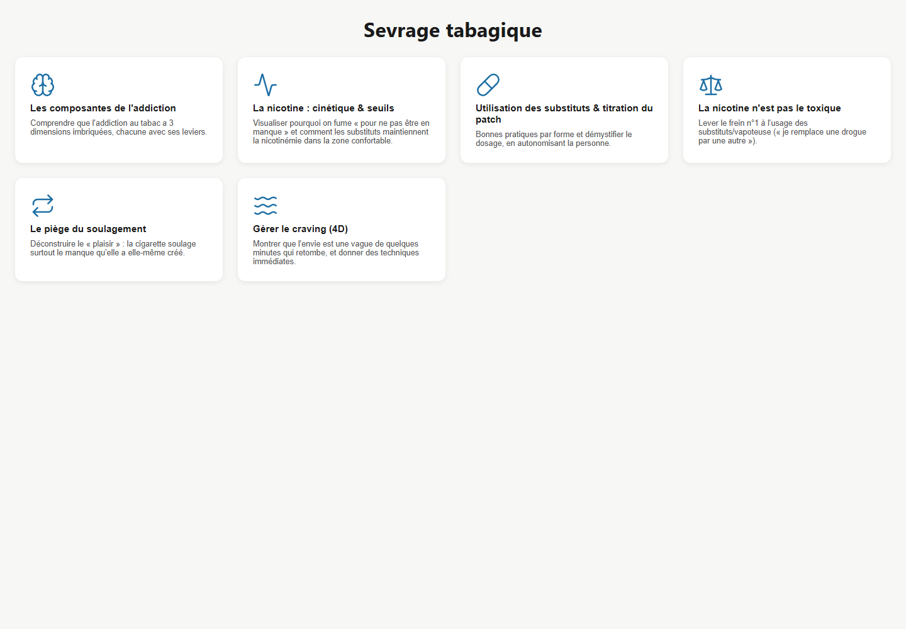

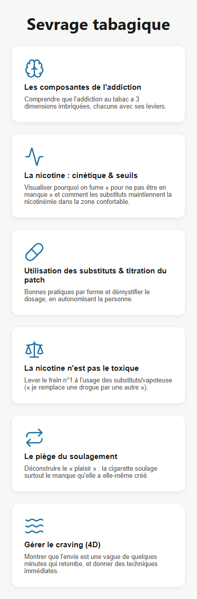

### Composantes de l’addiction

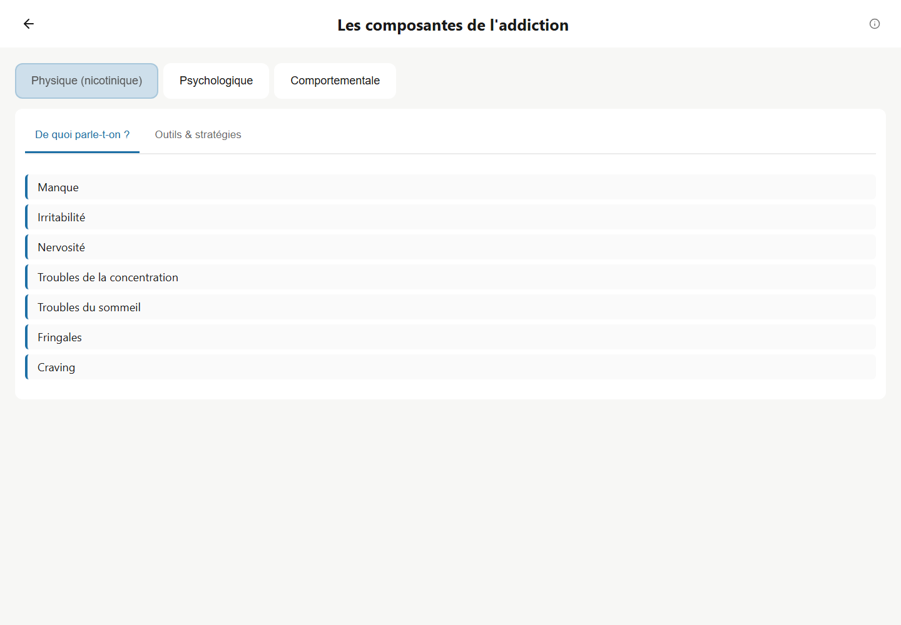

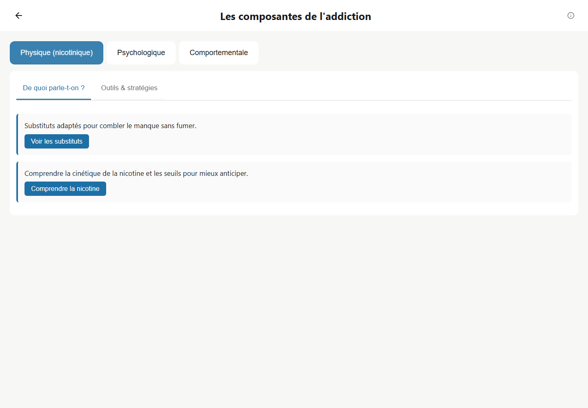

### Nicotine

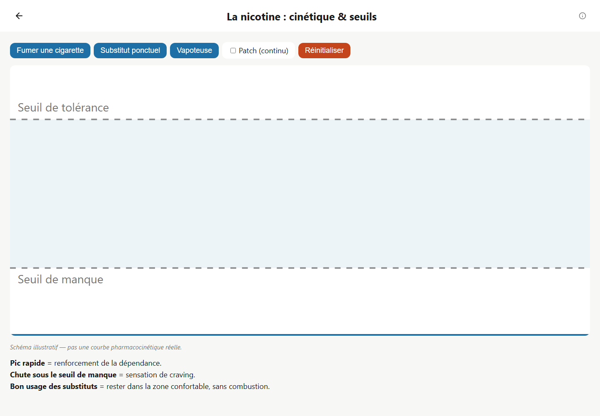

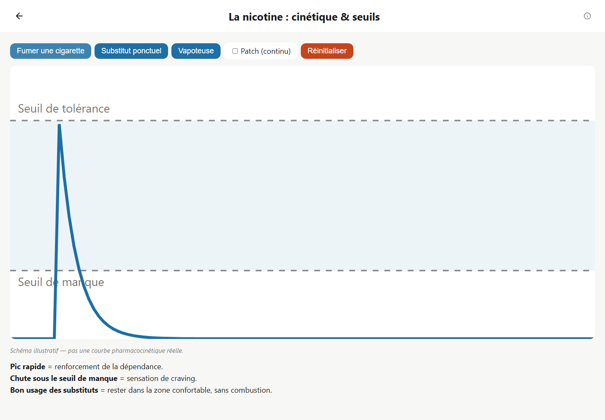

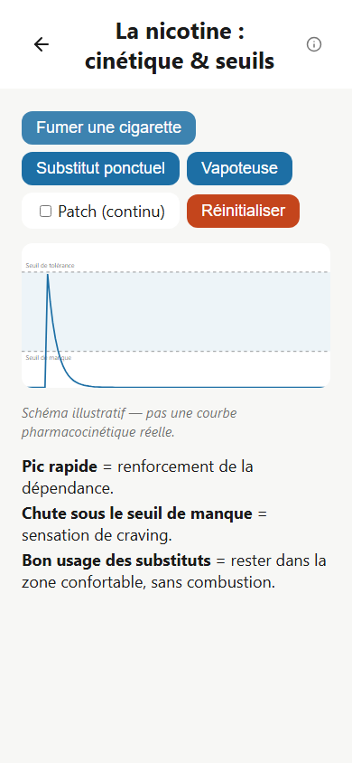

### Substituts

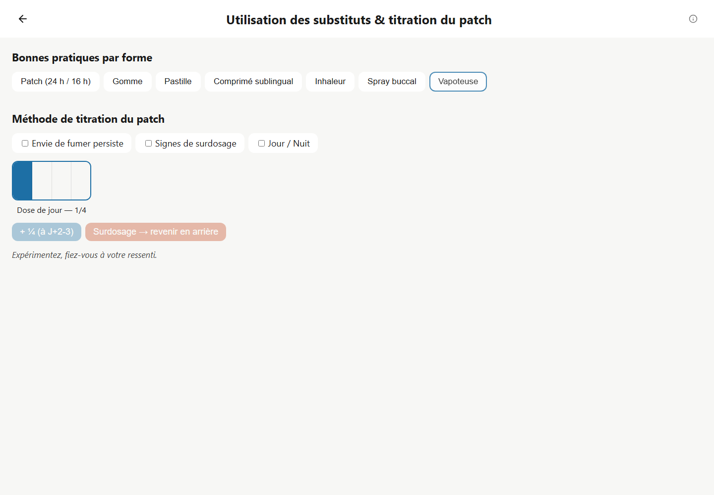

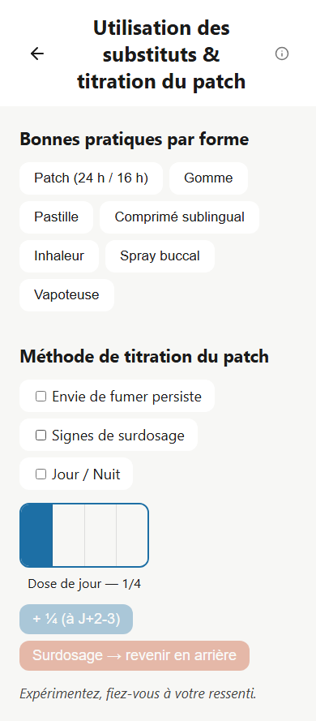

### Toxiques et nicotine

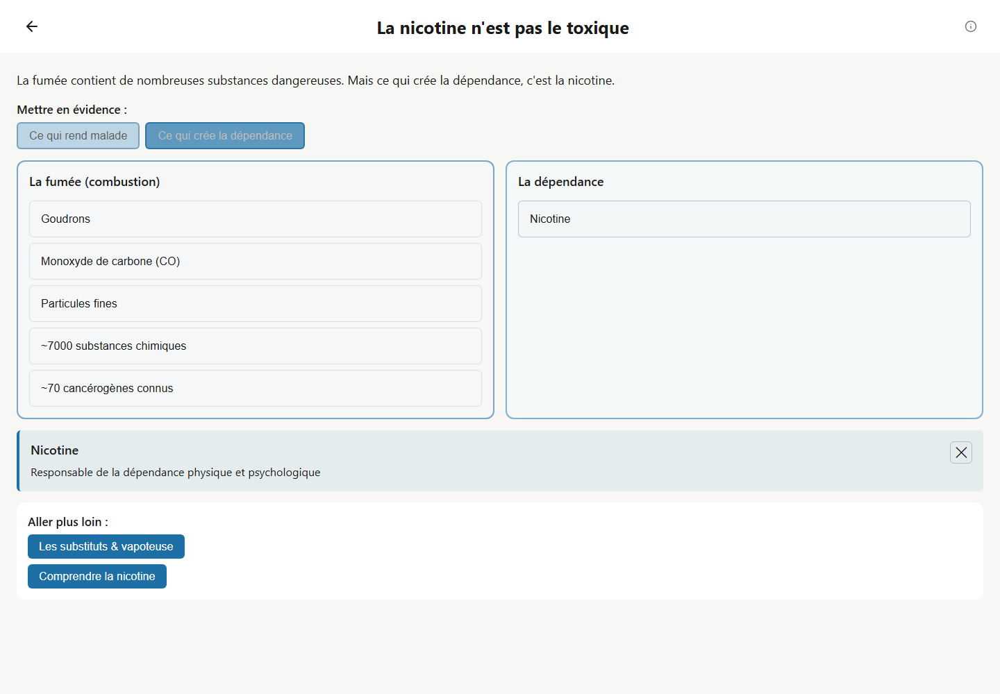

### Soulagement

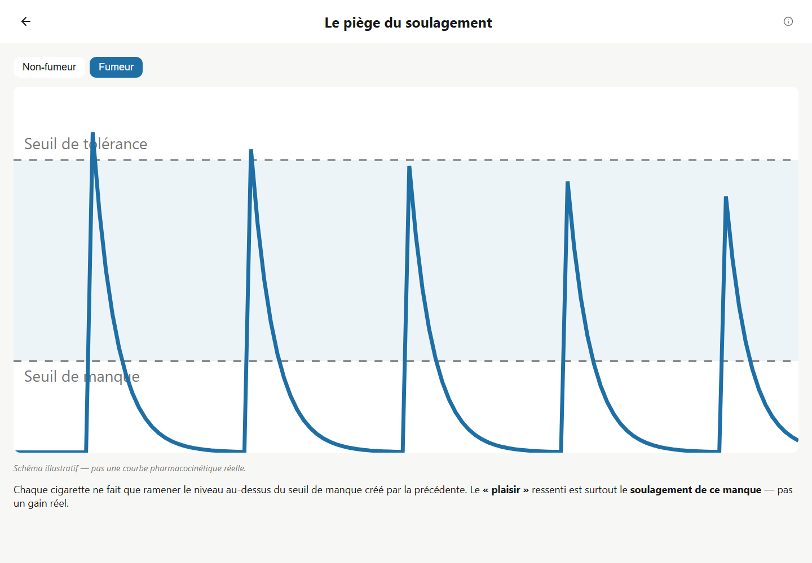

### Craving

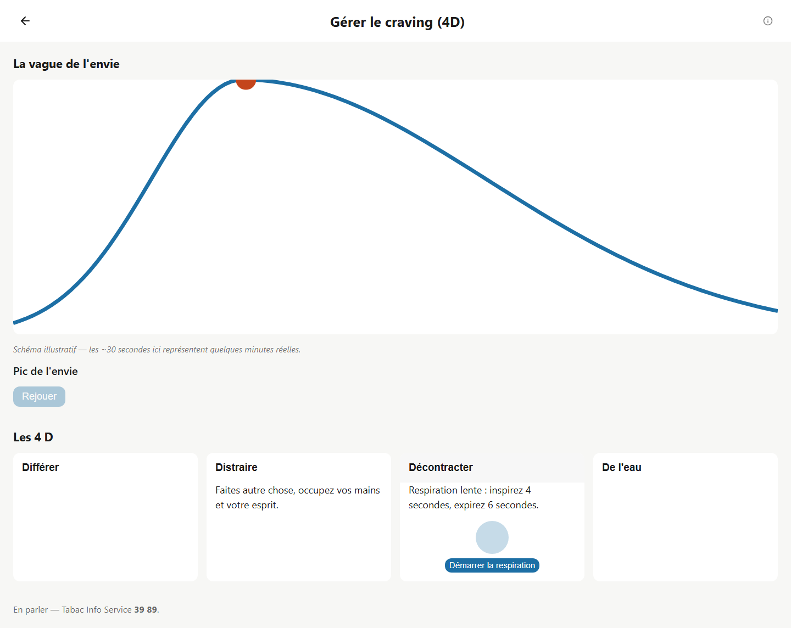
